# CI 파이프라인 구성

## 1. GitHub 리포지토리 생성

실습을 위해 github 레파지토리가 필요 합니다.

- front-app-repo: frontend 소스가 위치한 레포지토리

**(1) front-app-repo 라는 이름으로 Application repository 생성**

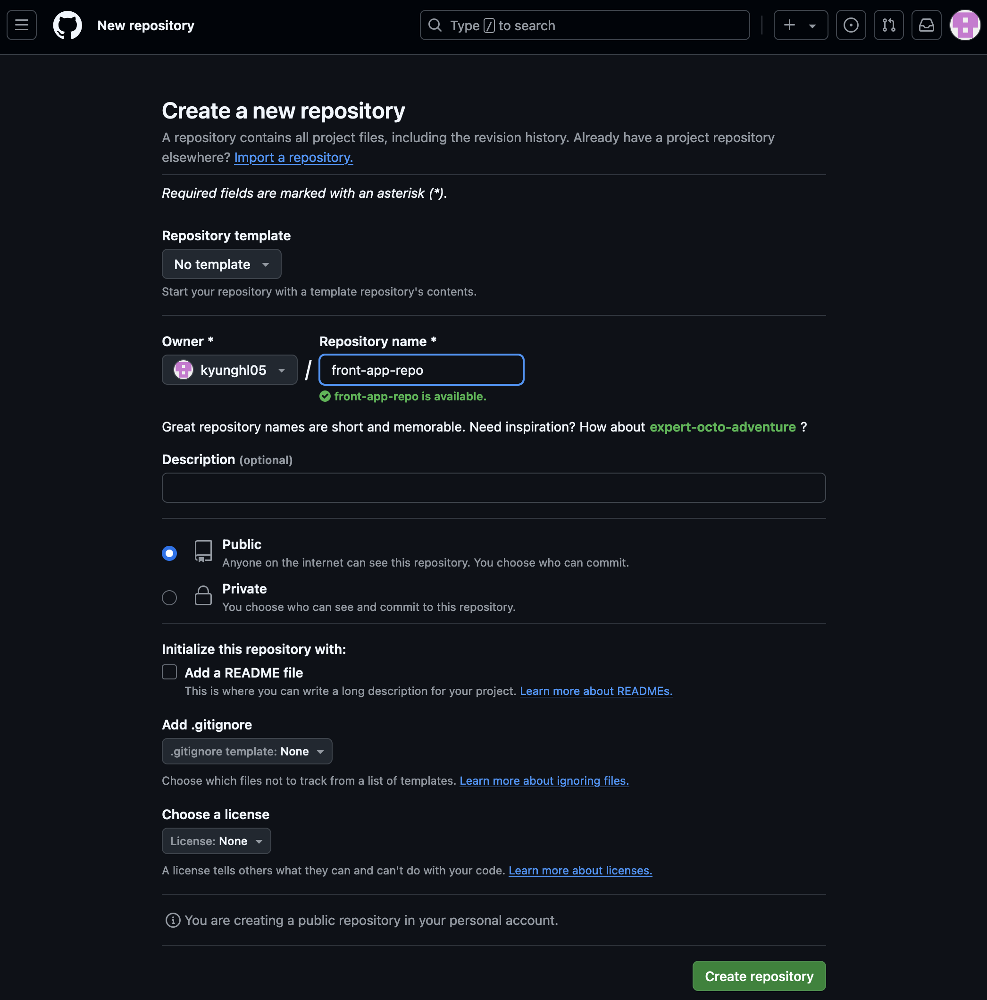

**(2) GitHub 인증 토큰 생성**

화면 우측 상단의 내 아이디를 클릭한 후 **Settings** 를 클릭하여 설정으로 이동

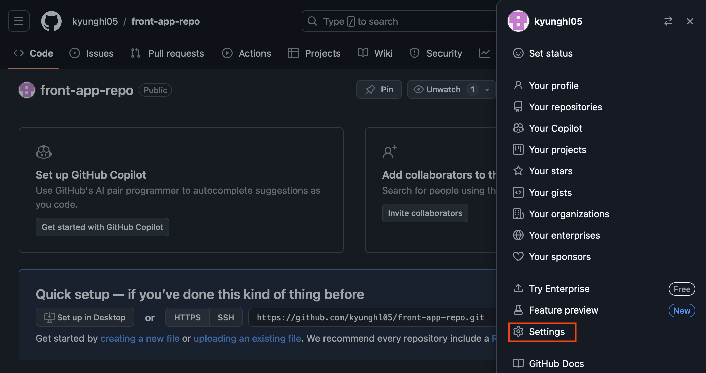

좌측 메뉴의 아래쪽에 있는 Developer settings를 클릭

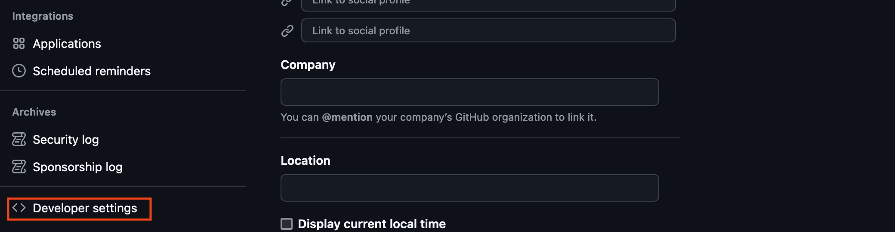

Fine-grained tokens를 생성해도 되지만, 여기서는 Tokens (classic)을 클릭한 후 **Generate new tokens** 를 클릭

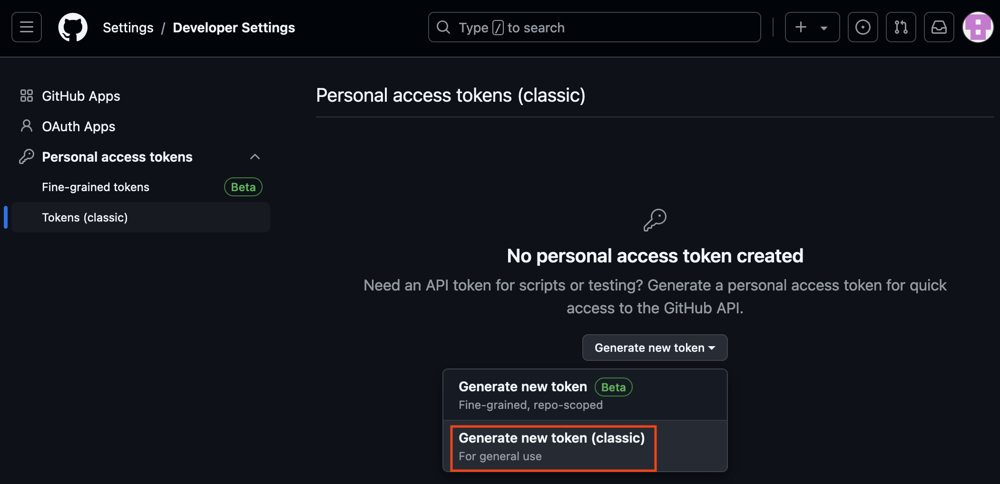

생성할 토큰의 이름을 적당히 입력하고 **repo**와 **workflow**의 체크박스를 선택한 후 하단의 **Generate token** 버튼을 클릭하여 토큰을 생성

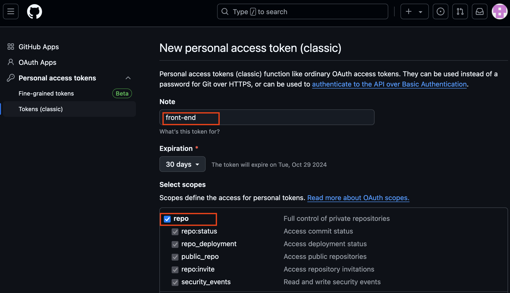

토큰이 생성되면 복사하기 버튼을 클릭하여 생성된 토큰을 복사하여 다음 단계에서 사용하기 위해 안전한 곳에 기록해 둡니다.

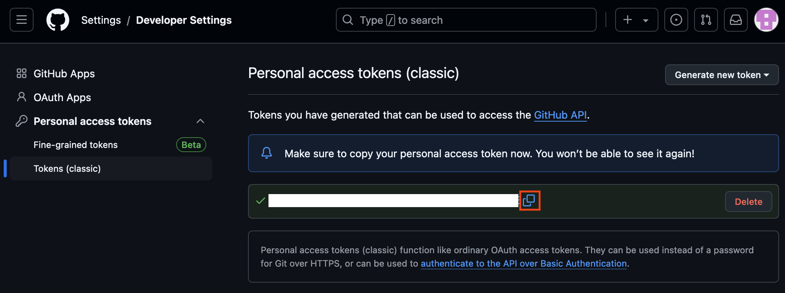

**(3) ECR repository 생성**

AWS CLI를 통해, 이미지 리포지토리를 생성합니다. 본 실습에서는 리포지토리 이름을 demo-frontend라고 설정합니다.

```bash
aws ecr create-repository \
--repository-name demo-frontend \
--image-scanning-configuration scanOnPush=true \
--region ${AWS_REGION}
```

## 2. front-end 코드 등록

**(1) front-end 소스코드 다운로드**

```bash
cd /home/ec2-user/environment
git clone https://github.com/joozero/amazon-eks-frontend.git
```

**(2) git remote 설정을 위해, amazon-eks-frontend 디렉토리의 git 초기화**

스크립트의 your-github-username를 실습자의 환경에 맞게 수정 해야 합니다.

```bash
cd ~/environment/amazon-eks-frontend
rm -rf .git
export GITHUB_USERNAME=your-github-username
```

**(3) git remote repo 설정**

front-app-repo 에 frontend 소스 코드를 push 합니다.

```bash
cd ~/environment/amazon-eks-frontend
git init
git add .
git commit -m "first commit"
git branch -M main
git remote add origin https://github.com/$GITHUB_USERNAME/front-app-repo.git
git push -u origin main
```

화면에 인증 프롬프트가 나타나면, github username과 위의 1.(2)에서 생성한 PAT 토큰을 입력합니다.

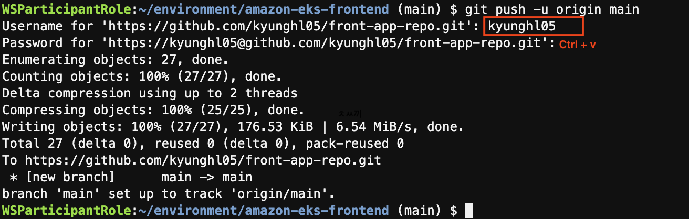

이 과정이 완료되면 github에서 확인 합니다. 

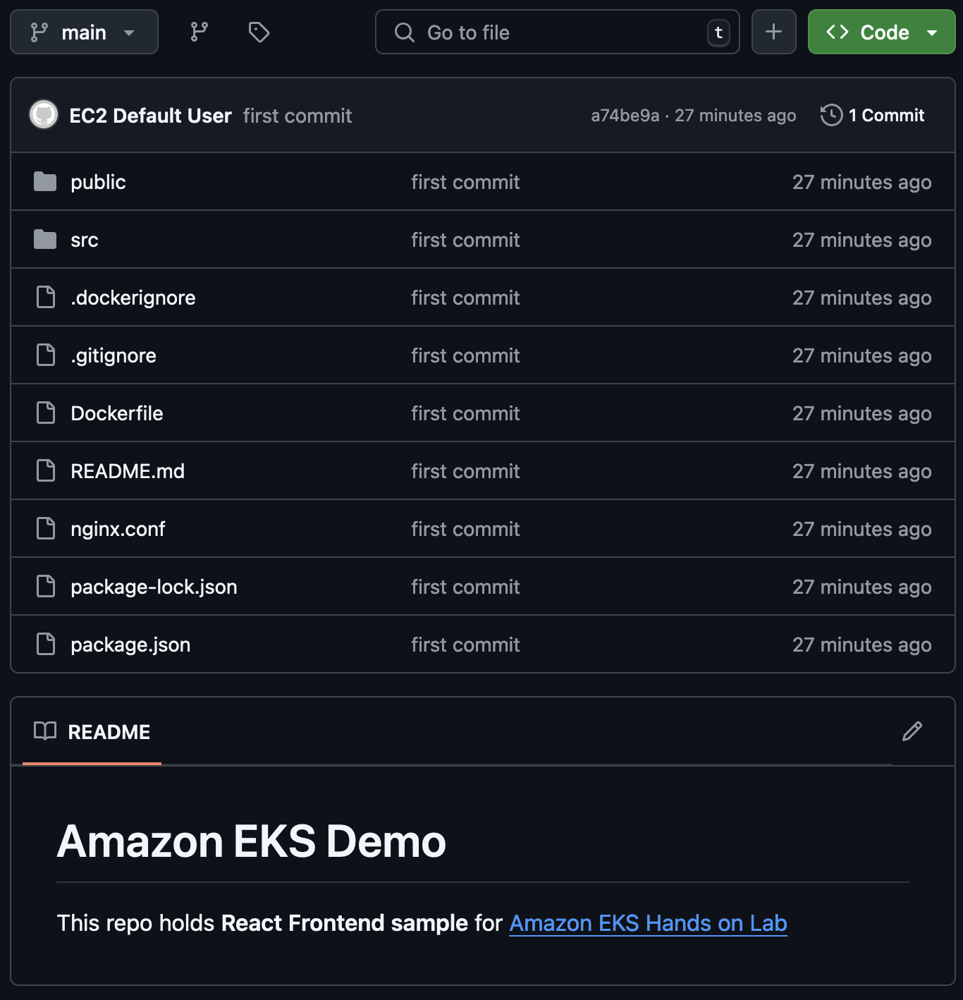

## 2. CI 파이프라인을 위한 최소 권한의 IAM 생성

front app 을 빌드 하고, docker 이미지로 만든 다음 이를 ECR 에 push 하는 과정은 gitHub Action을 통해 이루어 집니다. 이 과정에서 사용할 IAM User를 least privilege 를 준수하여 생성 합니다.

**(1) IAM user 생성**

```bash
aws iam create-user --user-name github-action
```

**(2) ECR policy 생성**

생성할 policy 파일을 만듭니다.

```bash
cd ~/environment
cat <<EOF> ecr-policy.json
{
    "Version": "2012-10-17",
    "Statement": [
        {
            "Sid": "AllowPush",
            "Effect": "Allow",
            "Action": [
                "ecr:GetDownloadUrlForLayer",
                "ecr:BatchGetImage",
                "ecr:BatchCheckLayerAvailability",
                "ecr:PutImage",
                "ecr:InitiateLayerUpload",
                "ecr:UploadLayerPart",
                "ecr:CompleteLayerUpload"
            ],
            "Resource": "arn:aws:ecr:${AWS_REGION}:${ACCOUNT_ID}:repository/demo-frontend"
        },
        {
            "Sid": "GetAuthorizationToken",
            "Effect": "Allow",
            "Action": [
                "ecr:GetAuthorizationToken"
            ],
            "Resource": "*"
        }
    ]
}
EOF
```

만들어진 파일을 통해 IAM policy를 생성 합니다. 이때 policy 이름으로 erc-policy 를 사용 합니다.

```bash
aws iam create-policy --policy-name ecr-policy --policy-document file://ecr-policy.json
```

**(3) ECR policy를 IAM user에 부여**

생성한 ecr-policy를 새로 생성한 IAM user 에게 할당 합니다.

```bash
aws iam attach-user-policy --user-name github-action --policy-arn arn:aws:iam::${ACCOUNT_ID}:policy/ecr-policy
```

## 3. githup secrets(AWS Credential, githup token) 생성

github action 에서 사용할 AWS credential, github token을 생성하고, 설정 합니다.

**(1) AWS Credential 생성**

github action이 빌드된 front app 을 docker image 로 만들어 ECR로 push 합니다. 이 과정에서 AWS credential 을 사용 합니다. 이를 위해 앞서 github-action이라는 별도의 least privilege 를 갖는 IAM User를 생성 했습니다. 이제 이 User의 Access Key, Secret Key를 생성 합니다.

```bash
aws iam create-access-key --user-name github-action
```

아래와 같은 출력 결과 가운데 "SecretAccessKey", "AccessKeyId"값을 따로 메모 저장 합니다. 이 값은 향후에 사용 합니다.

```json
{
  "AccessKey": {
    "UserName": "github-action",
    "Status": "Active",
    "CreateDate": "2021-07-29T08:41:04Z",
    "SecretAccessKey": "***",
    "AccessKeyId": "***"
  }
}
```

**(2) github secret 설정**

**front-app-repo** 리포지토리로 돌아가 **Settings > Secrets** 을 선택 합니다. 그리고 이어 화면 우측 상단의 **New repository secret** 을 클릭 합니다.

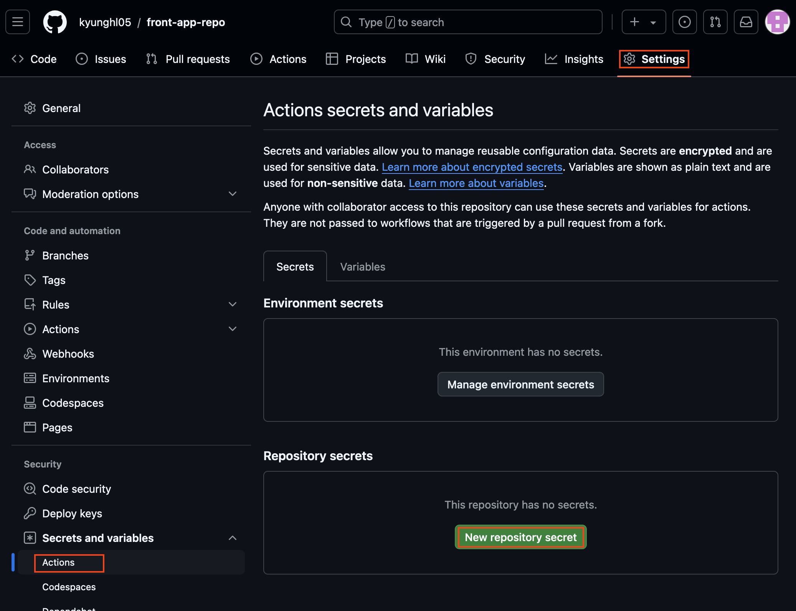

아래 화면 같이 **Name**에 `ACTION_TOKEN` **Value** 에는 앞서 복사한 personal access token 값을 넣은 후 **Add secret** 을 클릭 합니다.

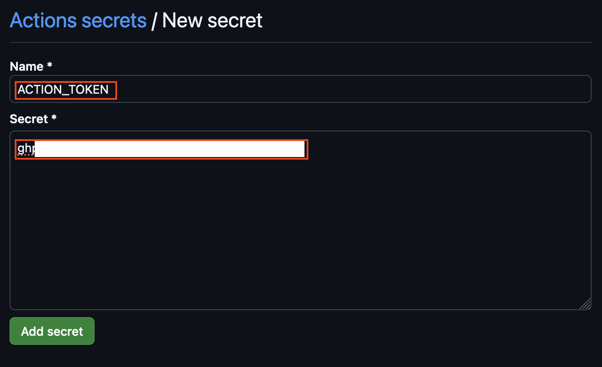

다음은 마찬가지 절차로, 앞서 생성 후 기록/저장 해둔 IAM USER 인 github-action 의 `AccessKeyId` 와 `SecretAccessKey`의 값을 Secret 에 저장 합니다.

이때 AccessKeyId 와 SecretAccessKey의 각각의 Name 값은 `AWS_ACCESS_KEY_ID`, `AWS_SECRET_ACCESS_KEY` 로 합니다.

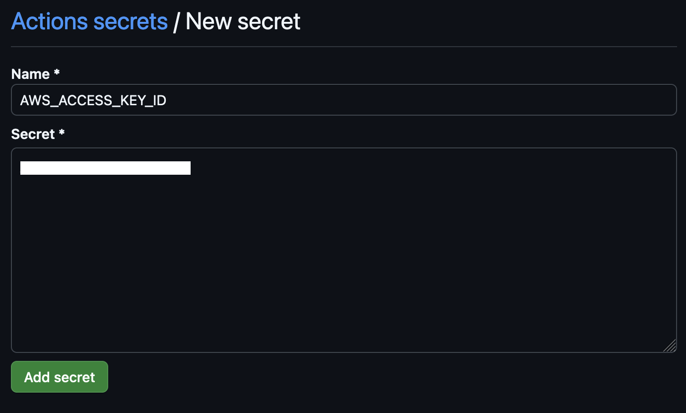

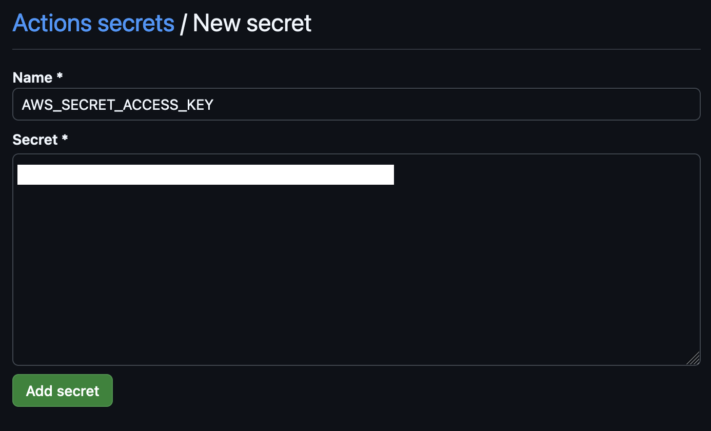

## 4. github action 을 위한 build 스크립트 생성

**(1) .github 폴더 생성**

```bash
cd ~/environment/amazon-eks-frontend
mkdir -p ./.github/workflows
```

**(2) github action 이 사용할 build.yaml 생성**

front app 을 checkout 하고, build 한 다음, docker container 로 만들어 ECR 로 push 하는 과정을 담고 있는 github action build 스크립트를 작성 합니다.

이 build 스크립트 내용 중 주목할 부분은 **docker image tag** 입니다. `$IMAGE_TAG` **값을 빌드 마다 랜덤한 값으로 만들어 이미지에 부착하여 ECR로 push 합니다.**

```bash
cd ~/environment/amazon-eks-frontend/.github/workflows
cat > build.yaml <<EOF

name: Build Front

on:
  push:
    branches: [ main ]

jobs:
  build:
    runs-on: ubuntu-latest
    steps:
      - name: Checkout source code
        uses: actions/checkout@v2

      - name: Check Node v
        run: node -v

      - name: Build front
        run: |
          npm install
          npm run build

      - name: Configure AWS credentials
        uses: aws-actions/configure-aws-credentials@v1
        with:
          aws-access-key-id: \${{ secrets.AWS_ACCESS_KEY_ID }}
          aws-secret-access-key: \${{ secrets.AWS_SECRET_ACCESS_KEY }}
          aws-region: $AWS_REGION

      - name: Login to Amazon ECR
        id: login-ecr
        uses: aws-actions/amazon-ecr-login@v1

      - name: Get image tag(verion)
        id: image
        run: |
          VERSION=\$(echo \${{ github.sha }} | cut -c1-8)
          echo VERSION=\$VERSION
          echo "::set-output name=version::\$VERSION"

      - name: Build, tag, and push image to Amazon ECR
        id: image-info
        env:
          ECR_REGISTRY: \${{ steps.login-ecr.outputs.registry }}
          ECR_REPOSITORY: demo-frontend
          IMAGE_TAG: \${{ steps.image.outputs.version }}
        run: |
          echo "::set-output name=ecr_repository::\$ECR_REPOSITORY"
          echo "::set-output name=image_tag::\$IMAGE_TAG"
          docker build -t \$ECR_REGISTRY/\$ECR_REPOSITORY:\$IMAGE_TAG .
          docker push \$ECR_REGISTRY/\$ECR_REPOSITORY:\$IMAGE_TAG

EOF
```

**(3) gitHub Action workflow 동작 점검**

이제 코드를 front-app-repo 로 push 하여 github action workflow를 동작 시킵니다. 위에서 작성한 build.yaml 을 기반으로 github action이 동작 합니다.

```bash
cd ~/environment/amazon-eks-frontend
git add .
git commit -m "Add github action build script"
git push origin maincd ~/environment/amazon-eks-frontend
git add .
git commit -m "Add github action build script"
git push origin main
```

github 화면으로 돌아가 변경 사항이 push 되었는지 확인하고, github action workflow가 다음과 같이 동작 하는지 확인 합니다. 

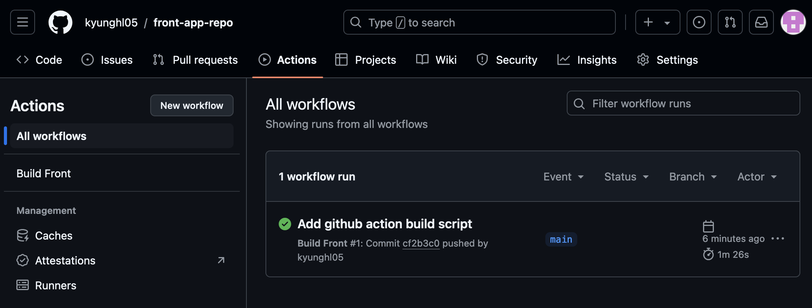

정상적인 build가 확인 되었다면 front app의 이미지가 사용하는 ECR 레파지토리인 demo-frontend 로 돌아가, 새로운 $IMAGE_TAG를 갖는 이미지가 push 되었는지 확인 합니다.

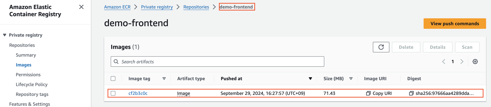
